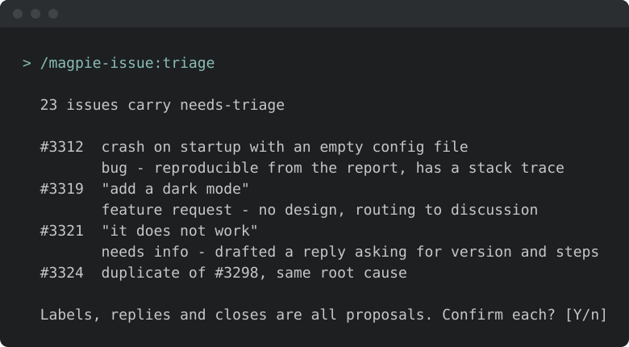
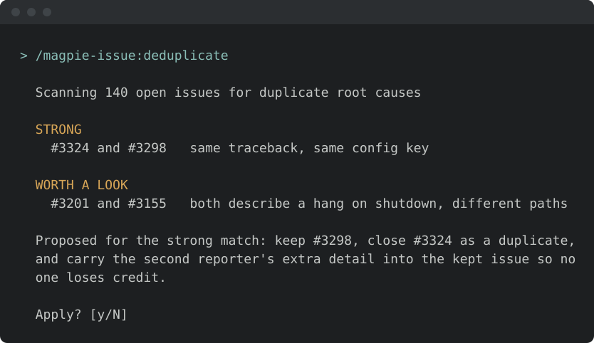
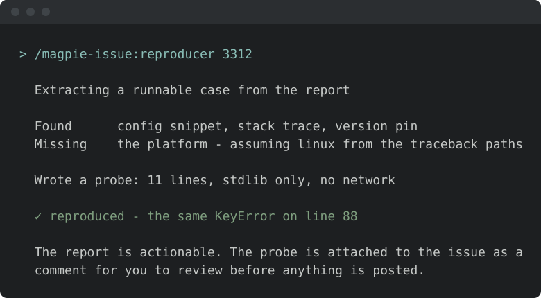

<!-- SPDX-License-Identifier: Apache-2.0
     https://www.apache.org/licenses/LICENSE-2.0 -->

<!-- START doctoc generated TOC please keep comment here to allow auto update -->
<!-- DON'T EDIT THIS SECTION, INSTEAD RE-RUN doctoc TO UPDATE -->
**Table of Contents**  *generated with [DocToc](https://github.com/thlorenz/doctoc)*

- [Issue management skill family](#issue-management-skill-family)
  - [Install & first runs](#install--first-runs)
    - [Before the first run](#before-the-first-run)
    - [Try these first](#try-these-first)
  - [Family boundary](#family-boundary)
  - [Skills](#skills)
  - [Status](#status)
  - [Cross-references](#cross-references)

<!-- END doctoc generated TOC please keep comment here to allow auto update -->

<!-- SPDX-License-Identifier: Apache-2.0
     https://www.apache.org/licenses/LICENSE-2.0 -->

# Issue management skill family

> **Scope.** Works on any project, ASF or not — no
> Apache-Software-Foundation-specific assumptions baked in.

Maintainer-facing skills for projects with a general-issue tracker
(JIRA, GitHub Issues, Bugzilla, GitLab Issues). Eight skills that
cover per-issue work, pool-level sweeps, deduplication, and
read-only reporting:

1. **Agentic Triage** — sweep open issues in the configured candidate pool,
   classify against the project's criteria, propose a disposition
   (BUG / FEATURE-REQUEST / NEEDS-INFO / DUPLICATE / INVALID /
   ALREADY-FIXED), execute on maintainer confirmation.
2. **Reassess** — sweep a configured pool of resolved or end-of-life
   issues and re-assess each against the current upstream codebase,
   surfacing silent fixes and partial fixes.
3. **Reproducer** — for a single issue identifying a code-level bug,
   extract the reporter's example code, adapt it to run on the
   current default branch, execute via the project's runtime, and
   compose a structured verdict. Read-only on the tracker.
4. **Fix-workflow** — for a triaged issue confirmed as a bug or
   feature, draft a fix PR (code change, regression test, commit
   message, PR description). Drafts only; the human committer
   reviews and pushes.
5. **Stale-sweep** — sweep open issues for inactivity past a
   configurable threshold, classify each as `REQUEST-UPDATE` (nudge)
   or `CLOSE-STALE` (pre-close notice), post one comment per issue on
   maintainer confirmation; closures require a second explicit
   confirmation step.
6. **Stats** — read-only dashboard over a directory of `verdict.json`
   files produced by reassess campaigns. Surfaces health rating,
   classification distribution, partial-fix surfaces, and per-component
   breakdowns.
7. **Deduplicate** — identify two open issues sharing the same root
   cause, draft a cross-link comment and a closing rationale, and
   close the duplicate on maintainer confirmation; closures require a
   second explicit confirmation step.
8. **Backlog stats** — read-only dashboard over the open issue
   backlog. Surfaces a health rating, prioritised recommendations,
   age and staleness breakdowns, area pressure ranking, and a
   triage-funnel summary without modifying any tracker state.

> [!TIP]
> **Why this family**
> - A triage pass over the backlog that proposes a disposition per issue instead of a label per issue
> - A runnable reproducer extracted from a bug report, so "cannot reproduce" stops being the first reply
> - Duplicates merged without losing the second reporter's detail, or their credit

## Install & first runs

Install just this family — one plugin, 8 skills. General-issue lifecycle: triage, reproduction, dedup, backlog.

Once you have [added the marketplace](../setup/marketplace-install.md):

```text
/plugin install magpie-issue@apache-magpie
```

New to Magpie? The [quick start](../quick-start.md) walks the whole path in
one place — install, the first `/magpie-setup` run, and a recording of it
happening — plus the other agents and the secure-isolation setup to run next.

### Before the first run

<!-- BEGIN generated: skill-config (tools/dev/check-skill-config.py --fix) -->

Every skill here resolves project-specific values from the adopter's
[`<project-config>/`](../../projects/_template/) directory — which is
`.apache-magpie-local/` (gitignored, yours) first, then
`.apache-magpie-overrides/` (committed, the project's).

**For yourself:** `/magpie-setup config` scaffolds and fills these locally.
Nothing is staged, nothing is committed, and it works on a repository that
has never adopted Magpie.

**For the project:** [`/magpie-setup adopt`](../setup/team-adoption.md)
commits them for every contributor, either scaffolded directly or promoted
from what you configured locally.

**Required.** Without these a skill would act on a guess, so it stops and
says which file is missing.

| File | What it carries | Read by |
|---|---|---|
| [`fix-workflow.md`](../../projects/_template/fix-workflow.md) | Fork / clone / toolchain specifics, backport-label policy, commit-trailer wording, PR scrubbing, private-PR fallback. | `fix-workflow` |
| [`issue-tracker-config.md`](../../projects/_template/issue-tracker-config.md) | Tracker URL, project key, auth model, default query templates. | `backlog-stats`, `deduplicate`, `reassess`, `reassess-stats`, `reproducer`, `stale-sweep`, `triage` |
| [`project.md`](../../projects/_template/project.md) | Project manifest. Identity, repositories, mailing lists, tools enabled, CVE tooling, GitHub project-board + issue-template field declarations. The single file every skill reads to resolve project-scoped references. | `stale-sweep`, `triage` |
| [`reassess-pool-defaults.md`](../../projects/_template/reassess-pool-defaults.md) | Named pools for reassessment sweeps (`open-eol`, `reopened`, `stale-unresolved`, project-specific). | `reassess` |
| [`reproducer-conventions.md`](../../projects/_template/reproducer-conventions.md) | Evidence-package directory layout and frozen-copy discipline. | `reproducer` |
| [`runtime-invocation.md`](../../projects/_template/runtime-invocation.md) | Build prerequisite, run-a-single-file recipe, stream-capture conventions, network/dependency handling. | `fix-workflow`, `reproducer` |

**Optional.** Each has a documented fallback; absent, the skill still runs.

| File | What it carries | Read by |
|---|---|---|
| [`canned-responses.md`](../../projects/_template/canned-responses.md) | Reusable reporter-facing reply templates. | `triage` |
| [`release-trains.md`](../../projects/_template/release-trains.md) | Active release branches, release-manager attribution per cut, rotation rosters, security-team roster. | `triage` |
| [`scope-labels.md`](../../projects/_template/scope-labels.md) | Scope label → CVE product / `packageName` / collection-URL mapping. Exactly one scope label per tracker. | `backlog-stats`, `reassess`, `triage` |
| [`stale-sweep-config.md`](../../projects/_template/stale-sweep-config.md) | Grace windows and exemption labels for stale sweeps. Absent, the framework defaults apply. | `backlog-stats`, `stale-sweep` |

<!-- END generated: skill-config -->

### Try these first

*Illustrative shapes, not real transcripts — your output will differ. Nothing
below sends, merges, or posts anything without you confirming it.*

**Triage the new issues.**

```text
/magpie-issue:triage
```



**Find the duplicates.**

```text
/magpie-issue:deduplicate
```



**Try to reproduce one.**

```text
/magpie-issue:reproducer
```



## Family boundary

This family sits **alongside** two related families:

- [`pr-management-*`](../pr-management/README.md) handles the
  pull-request queue (open PRs, code review, queue stats). PRs are
  not issues; the skills there operate on a different tracker
  surface and apply different criteria.
- [`security-issue-*`](../security/README.md) handles the security-
  issue tracker, with confidentiality and CVE-allocation constraints
  the general-issue family does not need. A project may use both
  families against different trackers (private security repo;
  public general-issue JIRA).

A maintainer of a project with both an issue tracker and an active
PR flow typically uses both `issue-*` and `pr-management-*` families,
configured with different trackers.

## Skills

| Skill | Mode | Purpose |
|---|---|---|
| [`issue-triage`](../../skills/issue-triage/SKILL.md) | Agentic Triage | Per-issue classification + disposition proposal |
| [`issue-reassess`](../../skills/issue-reassess/SKILL.md) | Agentic Triage | Pool-level sweep of resolved / EOL issues for re-assessment |
| [`issue-reproducer`](../../skills/issue-reproducer/SKILL.md) | — | Per-issue extraction + execution of code examples |
| [`issue-fix-workflow`](../../skills/issue-fix-workflow/SKILL.md) | Agentic Drafting | Drafts a fix PR for a triaged issue |
| [`issue-stale-sweep`](../../skills/issue-stale-sweep/SKILL.md) | Agentic Triage | Backlog hygiene: classifies dormant issues as `REQUEST-UPDATE` or `CLOSE-STALE`; posts one comment per issue on confirmation |
| [`issue-reassess-stats`](../../skills/issue-reassess-stats/SKILL.md) | — | Read-only campaign dashboard |
| [`issue-deduplicate`](../../skills/issue-deduplicate/SKILL.md) | Triage | Merge two open issues describing the same root cause; posts notices and closes the duplicate on explicit two-step confirmation |
| [`issue-backlog-stats`](../../skills/issue-backlog-stats/SKILL.md) | Triage | Read-only dashboard over the open issue backlog: health rating, area pressure, age breakdown, triage funnel, and staleness candidates |

`issue-reproducer` and `issue-reassess-stats` sit outside the MISSION
mode taxonomy; they are mechanical / read-only, not classificatory or
mutating.

## Status

**Experimental.** No adopter pilot has run an evaluation against
this family yet. Shape may change between framework versions.

To provide pilot feedback, copy
[`docs/pilot-report-template.md`](../pilot-report-template.md) into your
project notes, fill in each section, and optionally validate the filled-in
report with:

```bash
uv run --project tools/pilot-report-validator pilot-report-validate <your-report.md>
```

## Cross-references

- [Top-level README — Install](../../README.md#install) — 3-step bootstrap.
- [`projects/_template/README.md`](../../projects/_template/README.md) — adopter scaffold index.
- [`docs/modes.md`](../modes.md) — MISSION mode taxonomy that the
  `mode:` frontmatter field declares against.
- [`docs/setup/agentic-overrides.md`](../setup/agentic-overrides.md) —
  the override mechanism every skill in this family supports.
