<!-- SPDX-License-Identifier: Apache-2.0
     https://www.apache.org/licenses/LICENSE-2.0 -->

<!-- START doctoc generated TOC please keep comment here to allow auto update -->
<!-- DON'T EDIT THIS SECTION, INSTEAD RE-RUN doctoc TO UPDATE -->
**Table of Contents**  *generated with [DocToc](https://github.com/thlorenz/doctoc)*

- [Quick start](#quick-start)
  - [Installation or Adoption?](#installation-or-adoption)
  - [The walkthrough](#the-walkthrough)
    - [Step 1 — install from the Apache Magpie Marketplace](#step-1--install-from-the-apache-magpie-marketplace)
    - [Step 2 — run `/magpie-setup`](#step-2--run-magpie-setup)
    - [Step 3 — isolate the agent](#step-3--isolate-the-agent)
    - [Step 4 — guard every command](#step-4--guard-every-command)
    - [Step 5 — set up privacy](#step-5--set-up-privacy)
    - [Step 6 — use it](#step-6--use-it)
    - [Step 7 — consider adopting Magpie](#step-7--consider-adopting-magpie)
  - [What each family solves](#what-each-family-solves)
  - [Other installation methods](#other-installation-methods)
  - [Cross-references](#cross-references)

<!-- END doctoc generated TOC please keep comment here to allow auto update -->

# Quick start


*Illustrative. The whole of it: install, run a skill, get an answer you confirm.*

Install Apache Magpie into the agent you already use, in a couple of
commands: one to add the **Apache Magpie Marketplace**, one per family you
want. Nothing is
committed to your repository, and nothing is changed in it.

**This install is yours, on this machine.** It needs no decision from your
project and no opt-in from your teammates. Committing anything for other
people is a separate act called **adoption** —
[Installation or Adoption?](quick-start/two-ways.md) draws the line.

**What you get.** 75 skills your agent can run, grouped into 10 **families** —
PR triage and review, issue triage, security-report handling, release
management, contributor mentoring. Install only the families you need; each one
you add costs context in every session —
[what each family solves](quick-start/families.md) lists all ten, after the
install steps.

---

## Installation or Adoption?

**Installing** puts the marketplace and the plugins into your agent and writes
nothing to any repository. That is what the steps below do, and it is all most
people ever need. **Adoption** is the separate, later act of a repo's
maintainers committing a floor that everyone who clones it picks up.

The two differ in one thing only — whether anything is committed for other
people — and you do not have to choose before installing.
[**Installation or Adoption?**](quick-start/two-ways.md) compares them side by side.

---

## The walkthrough

Seven steps, in order. One and two are the install. Three, four and five are
the safety layers, and **all three are strongly recommended** — Magpie's skills
read issues, pre-disclosure security reports and private mailing lists, so none
of them is a nice-to-have. Six and seven are what you do with it.

### Step 1 — install from the Apache Magpie Marketplace

Installing is a **one-time, per-machine** step for whichever agent you use. It
writes nothing to any repository and your teammates are unaffected.


→ [**Prerequisite: install Magpie from your agent's
marketplace**](setup/marketplace-install.md) has the commands, one section per
agent: Claude Code, OpenAI Codex CLI, VS Code / GitHub Copilot, Google Gemini
CLI, Cursor, `microsoft/apm`, and JetBrains IDEs.

**Take the baseline — three plugins, strongly recommended on every machine:**

- **`magpie-setup`** — install this one first; nothing else installs, upgrades,
  configures or adopts without it, and it carries the secure-isolation skills
  from [Step 3](#step-3--isolate-the-agent).
- **`magpie-agent-guard`** — the deterministic pre-execution guard, a hook that
  inspects each shell command before it runs and denies the dangerous shapes.
- **`magpie-utilities`** — `list-skills` and the small tools you reach for when
  you want to know what is actually installed.

Those three are exactly the **floor** a project commits when it adopts Magpie,
so taking them is taking what a project would recommend to every contributor.

Then add **one plugin per family you actually want**, against a problem you
have today; you can install more at any time. Pick them from
[What each family solves](quick-start/families.md) — the ten families, with the
problem each one solves.

Each family's README opens with an **Install & first runs** section — the one
command for that family and a few things to try once it is in:
[setup](setup/README.md#install--first-runs) ·
[security](security/README.md#install--first-runs) ·
[release-management](release-management/README.md#install--first-runs) ·
[pr-management](pr-management/README.md#install--first-runs) ·
[issue](issue-management/README.md#install--first-runs) ·
[repo-health](repo-health/README.md#install--first-runs) ·
[contributor-growth](contributor-growth/README.md#install--first-runs) ·
[utilities](utilities/README.md#install--first-runs) ·
[mentoring](mentoring/README.md#install--first-runs) ·
[pairing](pairing/README.md#install--first-runs)

> [!IMPORTANT]
> **There is no install-everything plugin, by design.** Every installed skill
> advertises itself to the model on every turn, used or not — all ten families
> at once would be ~8.6k always-on tokens against 0.2–2.0k for a family you
> picked on purpose. See
> [Choosing a plugin](setup/marketplace.md#choosing-a-plugin-which-families).

> [!NOTE]
> **Per-family works on every agent listed.** A family plugin carries its
> skills as real directories, so nothing depends on a client following a
> symlink — measured on Codex and Gemini, not assumed.

> [!TIP]
> **Installed a family and want to use it now?**
> [Your first run with a family](quick-start/first-run.md) walks the whole
> thing in terminal steps — the pre-flight stopping, the setup wizard, the
> configuration it scaffolds, and the same command working on the retry.

---

### Step 2 — run `/magpie-setup`

The marketplace install above is complete on its own: the skills are in your
agent and you can start using them. `/magpie-setup` is what you run next when
you want Magpie wired into a **project** rather than only into your own agent —
a committed floor, project config, or overrides. Committing those for everyone
who clones the repo is **adoption** —
[`setup/team-adoption.md`](setup/team-adoption.md).

One command. It works out which method fits this checkout, prints the plan it
intends to carry out, and waits:

```text
/magpie-setup
```

**Or just ask for it.** Magpie's skills are model-invoked, so the slash form is
a shortcut, never the only way in — every step on this page has a plain-language
equivalent that works on every harness, including the ones with no slash
commands at all:

> set Magpie up for this project

Both reach the same skill. Use whichever you prefer; this page shows the slash
form first because it is unambiguous, and the sentence beside it because that
is what most people actually type.


Nothing is written before you approve it. Afterwards, `/magpie-setup verify`
(*check that Magpie is set up correctly here*) re-runs the health check and
drift detection, and `/magpie-setup:status` (*what Magpie do I have
installed?*) prints what is currently installed.

Not sure you need this step? [Installation or Adoption?](quick-start/two-ways.md)
draws the line.

**Every skill configures itself on first use.** You do not have to remember
which projects are set up, or run anything to prepare a family before you use
it: 65 of the 75 skills open with a silent pre-flight — the ten exceptions are
the setup skills themselves, which are what you run to fix whatever it finds.

The first time you call a skill in a project, that pre-flight works out how
Magpie is installed here and whether this project is adopted. If anything is
unresolved it **stops and proposes `/magpie-setup`** rather than guessing:

- a pinned-snapshot project whose snapshot was never fetched on this machine,
  or that is on a different framework version than the project pins;
- a marketplace install in a project with no `<project-config>/` directory,
  where every `<placeholder>` in the skill is unresolved.

The alternative to stopping is a skill that runs against the wrong tracker, so
it stops. Once the project is set up the check costs three file checks and
prints nothing, on every invocation thereafter.

Each family's README opens with a recording of exactly this — its own first
run, pre-flight and all. [What each family solves](quick-start/families.md)
links to all ten.

---

### Step 3 — isolate the agent

**Strongly recommended, and part of the default setup rather than a later
hardening pass.** Magpie's skills read issues, pre-disclosure security reports,
and private mailing lists, so this belongs in place before you point a skill at
anything real.

This is the first of three layers that do different jobs, and you want all
three:

| Step | Constrains | The thing the others cannot catch |
|---|---|---|
| **3 — isolate** | the **process** | a command reading `~/.ssh` or `~/.aws` |
| [**4 — guard**](#step-4--guard-every-command) | each **command** | a perfectly legal `gh pr comment` pinging four people who did not ask |
| [**5 — privacy**](#step-5--set-up-privacy) | the **data** | private-list mail reaching a model nobody approved |

Steps 3 and 4 arrive in one run; step 5 is its own.

Installing skills and configuring your host's isolation are separate steps,
and what the second one looks like depends on the agent you run:

| Harness | Next step |
|---|---|
| **Claude Code** | The guided install below. |
| **OpenAI Codex CLI** | [Codex setup lifecycle](adapters/codex.md#setup-isolated-lifecycle). |
| **Google Gemini CLI** | Ask `Use the magpie-setup-isolated-setup-install skill.` — tool sandboxing and policies, per the [Gemini setup lifecycle](adapters/gemini.md#setup-isolated-lifecycle). |
| **Anything else** | The [secure setup guide](setup/secure-agent-setup.md) and your runtime's adapter, for what it supports. |


On Claude Code, the first skill to run is the one that isolates the agent:

```text
/magpie-setup:isolated-setup-install
```

or, in plain language:

> isolate my agent with Magpie's secure setup

It walks you through the install interactively and surfaces every sudo,
shell-rc, and settings-file change for approval before applying it. Nothing is
applied without you seeing it first.

**What you are actually protecting against.** An agent runs shell commands on
your behalf, and your home directory is full of things it has no business
reading: SSH private keys, cloud credentials, `~/.aws`, `~/.kube`, browser
session tokens, `.env` files belonging to every other project you have checked
out. None of that is needed to triage a PR. The risk is not only a mistake —
an agent that reads issues and mailing lists is reading text written by
strangers, and that text can contain instructions aimed at the agent. If the
worst a poisoned issue body can do is make the agent read a file it cannot
reach, it can do nothing.

Three things go in, and they do different jobs:

- **A filesystem and network sandbox.** Every Bash subprocess runs under
  Seatbelt (macOS) or bubblewrap (Linux) and can see only the paths you
  allowed — normally this repository and little else. A command that tries to
  read `~/.ssh/id_ed25519` does not get a redacted answer; it gets "no such
  file". Network egress goes through the same confinement, so a command cannot
  quietly post what it read to somewhere else. This is enforced by the
  operating system, not by the agent agreeing to behave.
- **A clean environment.** The sandbox governs what a command can *reach*;
  it says nothing about what is already sitting in the environment it starts
  with. A shell that has `AWS_SECRET_ACCESS_KEY`, `GITHUB_TOKEN` and an API
  key exported has handed all three to every process it spawns, sandbox or
  not. The `claude-iso` wrapper starts the agent from `env -i` with a short
  passthrough list, so those variables are simply not there.
- **Visible state, because silent protection rots.** A sandbox you cannot see
  is a sandbox you stop noticing has turned itself off. The status line says
  which state you are in on every render, and a bold red banner fires before
  any bypass prompt — so the moment a session stops being protected is a
  moment you see, not one you discover later.

What it deliberately does **not** do: hold your signing key, push on your
behalf, or decide anything about which commands are reasonable. That last one
is the next step's job.

![Sandboxed session: the terminal footer opening with a green `[sandbox]` tag, followed by the project, branch, PR number and model](../assets/session-sandboxed.png)

The footer opens with the sandbox state and then says *which* session this
is — project, branch, the branch's PR, the model — so several sessions across
worktrees and repos stay apart. Green `[sandbox]` is the steady state; yellow
`[sandbox-auto]` means bash inside the sandbox skips the per-call prompt, and
bold-red `[NO SANDBOX]` is impossible to miss. Confirm the whole install with
`/magpie-setup:isolated-setup-verify` — *check my agent isolation* — which
reports ✓/✗/⚠ for every piece.

→ Full walkthrough: [`setup/secure-agent-setup.md`](setup/secure-agent-setup.md).
Why each layer exists: [`setup/secure-agent-internals.md`](setup/secure-agent-internals.md).
How your data reaches a model, and what never leaves the machine:
[`setup/privacy-llm.md`](setup/privacy-llm.md) — and
[Step 5](#step-5--set-up-privacy) is the skill that
configures it.

---

### Step 4 — guard every command

**Strongly recommended, and it is not the same thing as Step 3.** The sandbox
confines the *process*: bash sees only the paths you allow, and your `~/.ssh`
is out of reach. It has nothing to say about a command that is entirely within
its rights — a `gh pr comment` that pings four maintainers who did not ask to
be pinged, a `git push --force` onto a branch with nothing on it, a CVE
identifier in a public PR title before the embargo lifts. Those are legitimate
commands with the wrong consequences.

`magpie-agent-guard` from [Step 1](#step-1--install-from-the-apache-magpie-marketplace)
is the layer that catches them. Where the sandbox asks *can this command reach
that file*, the guard asks *should this particular command run at all* — and it
asks it in the gap between the model deciding to run something and the shell
actually running it.



**Deterministic is the whole point.** A rule written in a `SKILL.md` is a
sentence the model reads at the start of a session and is *asked* to keep in
mind — through forty tool calls, a compaction, and an issue body that says
something the model finds persuasive. Most of the time it does. "Most of the
time" is fine for a style preference and useless for a rule whose violation
posts something to a public repository under your name, because the cost is
not evenly spread: one slip on a quiet Tuesday is a notification to four
maintainers, or a CVE identifier visible before the embargo lifts.

So these rules are not written in a `SKILL.md` at all. They are Python, in a
hook the harness calls before the Bash tool runs, and they get a veto. The
guard sees the exact command, decides, and either lets it through or refuses:
a refused command is **not run** — not posted, not retried, and not worked
around by rephrasing. The model is shown the reason and the deterministic fix
(*"use a backtick `` `login` `` instead of `@login`"*), so it corrects rather
than guesses.

This is also the layer that does not care why the command was issued. A
prompt-injected instruction in an issue body and an honest mistake produce the
same `gh pr comment`, and the guard treats them identically — which is exactly
what you want from something whose job is to be unpersuadable.

The guards that ship:

| Guard | Denies | Because |
|---|---|---|
| `commit-trailer` | a `git commit` message carrying `Co-Authored-By:` | agents record themselves with `Generated-by:`; co-authorship is a claim about a person |
| `empty-rebase` | `git push --force` of a branch with no commits over its base | an empty force-push to a PR head auto-closes it *and* revokes write |
| `mention` | an `@`-mention of anyone but the author in a PR/issue comment | author-directed feedback should not ping maintainers who did not ask |
| `mark-ready` | marking a PR ready while its head SHA has workflows awaiting approval | "ready for review" has to mean CI actually ran |
| `security-language` | a CVE id or fix language in a **public** PR title or body | pre-disclosure content stays pre-disclosure |

It arrives with the same run as Step 3 — `/magpie-setup:isolated-setup-install`
registers the dispatcher, populates `~/.claude/scripts/guards.d/` from both the
bundled rules and every skill that owns one, and wires the `PreToolUse` hook.
Skills you install later contribute their own guards to the same directory.

The rule set is one harness-agnostic core with a thin adapter per harness, so
Claude Code, OpenCode, Kiro and Gemini CLI all enforce byte-for-byte identical
decisions. **Codex and Cursor have no action guard today** — the sandbox from
Step 3 still applies there, this layer does not; the
[adapters matrix](adapters/README.md) tracks which harness has what.

Per-command escape hatches exist and are explicit — `MAGPIE_ALLOW_MENTIONS=1`
for the one case where you do mean to ping someone. A guard you cannot get past
when you genuinely need to gets disabled wholesale, which is worse.

→ Full reference, including how to contribute a guard:
[`tools/agent-guard/README.md`](../tools/agent-guard/README.md).

---

### Step 5 — set up privacy

**Strongly recommended, and the one step that is about your project's data
rather than your machine.** Steps 3 and 4 constrain what the agent can reach
and what it can run. Neither has an opinion about the thing Magpie is actually
for: reading a PMC's private list, or a security report that is still under
embargo, and sending it to a model.

```text
/magpie-setup:privacy-llm
```

> set up privacy for this project


**What makes this different from the other two.** Steps 3 and 4 are about a
command that should not run. This one is about a command that *should* run, and
does exactly what it was asked, and in doing so sends somebody else's
confidential text to a third party. Summarising a private@ thread is a
legitimate, useful thing for a skill to do. It is also an export — of mail that
a PMC sent on the understanding that it stayed inside the PMC, or of a security
report whose reporter is waiting on an embargo. Nobody on those threads agreed
to a model provider being in the room. That is not a bug you can sandbox away;
it is a decision, and it needs to have been made on purpose, by the project,
before the skill runs.

Two mechanisms, separate on purpose because they protect different people:

- **The approved-LLM gate** protects *the project*. It covers private
  foundation lists: a skill refuses to fetch unless **every** model in the
  active stack is in the approved registry. The failure it exists to prevent is
  a quiet one — you add a local Ollama model to speed something up, or your
  harness starts routing through a different endpoint, and the set of parties
  who can see private@ mail has changed without anyone deciding that. The gate
  turns that from a silent change into a refusal with a name attached.

  It is a gate, not a filter: it blocks the fetch rather than sanitising the
  content, because there is no way to partially send an email.

- **PII redaction** protects *third parties*. It covers security-report mail,
  where the problem is not the reporter — they wrote to you and the security
  team knows who they are — but the people they mention. A report frequently
  names a co-researcher, a downstream maintainer, or the person whose account
  was compromised. None of them chose to be in that thread. Before any model
  sees the text, those names and addresses are swapped for hash-prefixed
  identifiers (`N-a3f9d2`, `E-7c1b04`); the mapping that reverses it stays on
  your machine and is never sent anywhere. People already public as
  collaborators on the repo are left alone — redacting a name the tracker
  already shows buys nothing.

  This runs under **every** variant, including the plain one where the agent is
  the only model in the stack. "We only use one provider" is not a reason to
  hand it a bystander's email address.

The skill detects the stack rather than interviewing you about it, proposes the
matching variant from
[the privacy-LLM recipes](setup/privacy-llm.md), writes it to the gitignored
`.apache-magpie-local/`, and then **proves it**: it runs the gate and a redactor
round-trip rather than declaring the configuration correct. A gate that says no
is the useful output — it names which model is unapproved and leaves the file
alone until you decide.

Re-run it after `/magpie-setup upgrade`: what counts as default-approved can
narrow between versions, and the gate is where you find out.

> [!NOTE]
> **The registry is provisional.** It reflects the framework maintainers'
> working position in the absence of a ratified ASF Legal policy for
> AI-assisted handling of foundation private data.
> [`setup/privacy-llm.md`](setup/privacy-llm.md) carries the full caveat, and
> the skill repeats it when asked whether a variant is "allowed".

---

### Step 6 — use it


Ask in plain language:

> review PR #5193

> triage the latest security reports

or call a skill by name. A marketplace install namespaces skills under the
**plugin** that provides them, as `/<plugin>:<skill>`:

```text
/magpie-pr-management:triage
/magpie-security:issue-triage
```

`/magpie-utilities:list-skills` — *what Magpie skills do I have?* — prints
everything that is installed.

---

### Step 7 — consider adopting Magpie


Everything so far was yours alone: the plugins live in your agent, and your
repository has not changed. **Adoption is the separate act of deciding this for
the project** — and it belongs to the repo's maintainers, together, not to
whoever installed first.

Adopting commits a **floor**: an `.apache-magpie.lock` recording what the
project recommends, and a default plugin set in the repo's
`.claude/settings.json` derived from it. A contributor who clones the repo and
trusts it then arrives with those families already enabled — no install step,
no instructions to follow. It is a floor, never a ceiling: nobody is stopped
from installing more or running a newer Magpie, and a maintainer can reverse
the whole thing in a PR.

Worth doing once the project — not one maintainer — agrees on what it wants to
recommend. It obliges nobody: a contributor who would rather not use Magpie at
all is unaffected.

The command is `/magpie-setup adopt`, or ask for it — *adopt Magpie for this
repository so everyone gets it on clone*. Nothing runs it for you: unlike
configuration, adoption is never automatic.

→ [**Team adoption**](setup/team-adoption.md) is the full walkthrough: what
gets committed, how the floor is chosen, and what a contributor sees on clone.
Still deciding? [**Installation or Adoption?**](quick-start/two-ways.md)
compares the two side by side.

---

## What each family solves

Skills ship in ten **families**, and you are not meant to take all of them.
[**What each family solves**](quick-start/families.md) lists every one with the
problem it solves and what it offers, so you can pick against a problem you
have today.

---

## Other installation methods

The marketplace is not the only route. A project can install the framework as a
**pinned snapshot** committed to the repo — the answer when an agent has no
marketplace at all, when you need the signed ASF source release, or when every
contributor and CI job should sit on one committed version. A clone of the
framework itself takes a third route and **self-adopts**.

→ [**Other installation methods**](quick-start/other-install-methods.md) covers
all three, with the copy-pasteable bootstrap for each. They are complementary, not exclusive:
pin the snapshot for the project and keep the marketplace plugin for yourself
if you prefer.

---

## Cross-references

- [`docs/index.md`](index.md) — what Magpie is and which skill families exist.
- [**The Apache Magpie Marketplace**](setup/marketplace.md) — the full
  reference: every agent that can add it, per-family plugins, versioning.
- [`docs/prerequisites.md`](quick-start/prerequisites.md) — what individual skills need
  (GitHub auth, Gmail MCP, browser).
- [`docs/setup/README.md`](setup/README.md) — the setup skill family.
