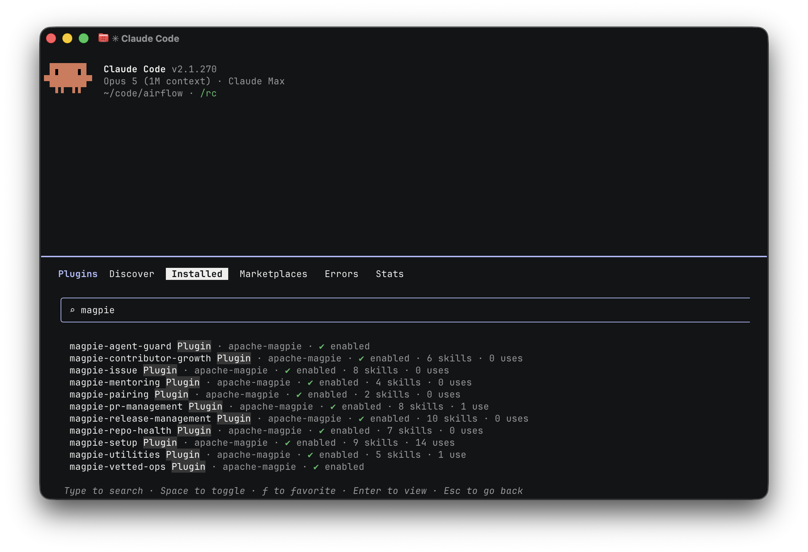

<!-- SPDX-License-Identifier: Apache-2.0
     https://www.apache.org/licenses/LICENSE-2.0 -->

<!-- START doctoc generated TOC please keep comment here to allow auto update -->
<!-- DON'T EDIT THIS SECTION, INSTEAD RE-RUN doctoc TO UPDATE -->
**Table of Contents**  *generated with [DocToc](https://github.com/thlorenz/doctoc)*

- [Quick start](#quick-start)
  - [Installation or Adoption?](#installation-or-adoption)
  - [The walkthrough](#the-walkthrough)
    - [Step 1 — install from the Apache Magpie Marketplace](#step-1--install-from-the-apache-magpie-marketplace)
    - [Step 2 — run `/magpie-setup`](#step-2--run-magpie-setup)
    - [Step 3 — isolate & guard](#step-3--isolate--guard)
    - [Step 4 — set up privacy](#step-4--set-up-privacy)
    - [Step 5 — use it](#step-5--use-it)
    - [Step 6 — consider adopting Magpie](#step-6--consider-adopting-magpie)
  - [What each family solves](#what-each-family-solves)
  - [Other installation methods](#other-installation-methods)
  - [Cross-references](#cross-references)

<!-- END doctoc generated TOC please keep comment here to allow auto update -->

# Quick start


*Illustrative transcript: installation followed by a triage proposal.*

This guide covers plugin installation, project configuration, agent isolation, and privacy setup.
You need a supported agent and access to the systems your chosen skills use; see [prerequisites](quick-start/prerequisites.md).
Install only the [families](quick-start/families.md) you need, such as PR management or repository-health audits.

## Installation or Adoption?

**Installation** adds plugins to your agent on this machine.
**Configuration** supplies the repository-specific values those skills need, using gitignored files for individual use.
**Adoption** commits shared configuration and a recommended plugin set for the project.

For example, you can install PR-management skills and configure them locally to review a repository without changing your teammates' setup.
Only use adoption if the maintainers want to share that configuration.
See the [comparison](quick-start/two-ways.md) for file locations and ownership.

## The walkthrough

Follow steps 1–5 for individual use.
Step 6 is optional team adoption.
Set up isolation and privacy controls before running skills against external reports or private data.

### Step 1 — install from the Apache Magpie Marketplace

Add the marketplace and install plugins at user scope.
This step does not write to the repository.


The [marketplace installation reference](setup/marketplace-install.md) has commands for Claude Code, Codex CLI, VS Code / GitHub Copilot, Gemini CLI, Cursor, `microsoft/apm`, and JetBrains IDEs.

Install the three recommended baseline plugins, then add the families you need:

| Plugin | Purpose |
|---|---|
| `magpie-setup` | Install first. Provides installation, configuration, upgrades, adoption, and isolation setup. |
| `magpie-agent-guard` | Inspects shell commands before execution and blocks prohibited command patterns on supported agents. |
| `magpie-utilities` | Lists installed skills and provides skill-authoring and framework-maintenance tools. |

For PR triage and review, add `magpie-pr-management`.
The [family reference](quick-start/families.md) lists the other choices and links to their first-run examples.

In Claude Code, open `/plugin`, select *Installed*, and filter to `magpie`:



Check that the selected plugins are enabled and come from `apache-magpie`.
Installed skill descriptions consume model context even when unused: approximately 0.2–2.0k tokens per family, or 8.6k for all ten.
See [choosing a plugin](setup/marketplace.md#choosing-a-plugin-which-families) for details.

### Step 2 — run `/magpie-setup`

From the target repository, run setup to inspect the checkout and select the appropriate configuration path:

```text
/magpie-setup
```

You can also ask in plain language:

> set Magpie up for this project

Use plain language if your agent does not support slash commands.


Review the proposed setup before approving changes.
For individual use, `/magpie-setup config` writes gitignored configuration to `.apache-magpie-local/`; adoption is a separate command.
After setup, `/magpie-setup verify` checks installation health and drift, and `/magpie-setup:status` lists the installed components.

Skills also check configuration on first use.
If required project files are missing, they invoke the local configuration flow before continuing.
If a pinned snapshot is missing or differs from the project's pin, they stop for setup or upgrade.
They do not guess the target repository or tracker.

See [your first run with a family](quick-start/first-run.md) for a worked PR-triage example, including the files created and the retry.

### Step 3 — isolate & guard

Configure isolation before reading external issues or private reports.
The **sandbox** restricts filesystem and network access.
The **action guard** inspects commands and rejects prohibited actions where the agent supports it.

For example, a filesystem restriction can prevent a command from reading `~/.ssh`.
It does not decide whether posting a review comment is appropriate; command guards and human approval address that separately.

| Harness | What to run |
|---|---|
| **Claude Code** | `/magpie-setup:isolated-setup-install` — the guided install below. |
| **OpenAI Codex CLI** | [Codex setup lifecycle](adapters/codex.md#setup-isolated-lifecycle). |
| **Google Gemini CLI** | [Gemini setup lifecycle](adapters/gemini.md#setup-isolated-lifecycle). |
| **Anything else** | The [secure setup guide](setup/secure-agent-setup.md) and your runtime's adapter. |

```text
/magpie-setup:isolated-setup-install
```

> isolate my agent with Magpie's secure setup


The installer asks for approval before privileged operations or changes to shell startup and settings files.
On the Claude Code setup shown here, it configures the sandbox, credential-stripped environment, action guard, and status line.

The status line reports the current sandbox state:

![A session where /sandbox reports "Sandbox enabled with auto-allow for bash commands": the terminal footer opens with a yellow `[sandbox-auto]` tag, followed by the project, the branch and the model](../assets/session-sandboxed.png)

| Tag | Means |
|---|---|
| `[sandbox]` green | sandboxed, still prompting per command |
| `[sandbox-auto]` yellow | sandboxed, not prompting — auto-allow |
| `[NO SANDBOX]` bold red | not sandboxed |

![A session after /sandbox reports "Sandbox disabled": the footer opens with a bold-red `[NO SANDBOX]` tag ahead of the project, branch and model](../assets/session-no-sandbox.png)

The footer also identifies the project, branch, model, and PR when available.
Run `/magpie-setup:isolated-setup-verify`, or ask *check my agent isolation*, to check each component.

See [secure-agent internals](setup/secure-agent-internals.md) for the limits of each layer and the [action-guard reference](../tools/agent-guard/README.md) for blocked commands.
The [adapters matrix](adapters/README.md) lists agent-specific coverage; Codex and Cursor do not currently have an action guard.

### Step 4 — set up privacy

Configure privacy controls before fetching private reports or mailing-list content.
A sandbox restricts access to data, but does not determine which model may receive data once it has been read.

```text
/magpie-setup:privacy-llm
```

> set up privacy for this project


| Mechanism | Behaviour |
|---|---|
| Approved-LLM gate | Refuses to fetch private-list mail unless every model in the active stack is approved. |
| PII redaction | Replaces third-party personal information in reports with hash-prefixed identifiers before model processing. The reporter's own identity and tracker collaborators are exempt. |

The skill detects the active stack, configures the appropriate variant in gitignored `.apache-magpie-local/`, and exercises both mechanisms.
If it reports an unapproved model, resolve the approval or routing issue before retrying the private-data task.
For example, access to a mailbox does not itself authorize sending its private-list messages to a newly configured model.

Re-run privacy setup after `/magpie-setup upgrade`, because the approval policy may change.
See [privacy setup](setup/privacy-llm.md) for recipes and exceptions.
The approval registry is provisional pending a ratified ASF Legal policy for AI-assisted handling of Foundation private data.

### Step 5 — use it


Start with a bounded task:

> Summarize the open PR backlog for this repository. Do not post comments or change labels.

Or invoke a skill by name.
Marketplace commands use `/<plugin>:<skill>`:

```text
/magpie-pr-management:triage
/magpie-security:issue-triage
```

For triage, expect an assessment and proposed actions, not immediate tracker changes.
You can narrow the next request:

> Review the oldest PR that is waiting for a reviewer. Show me the draft review before posting it.

Use `/magpie-utilities:list-skills`, or ask *what Magpie skills do I have?*, to list the installed skills.
See [skill names by install method](setup/marketplace.md#skill-names-differ-by-install-method) if you use a pinned snapshot.

### Step 6 — consider adopting Magpie


Skip this step for individual use.
The preceding setup may have written local configuration, but has not committed a recommendation for your teammates.

When the maintainers agree to adopt Magpie, run `/magpie-setup adopt`.
It prepares a shared configuration directory, an `.apache-magpie.lock` recording the recommended version and families, and agent settings derived from that recommendation.
For Claude Code, those settings live in `.claude/settings.json`.
Review the prepared changes before committing them.

Contributors using the supported plugin setup receive the recommended families when they clone and trust the repository.
They may install additional families, use a newer version, or choose not to use Magpie.
Adoption is never automatic.
See [team adoption](setup/team-adoption.md) for the file layout and contributor experience.

## What each family solves

The [family reference](quick-start/families.md) lists the ten families, their tasks, and their outputs.
For example, choose `repo-health` for a dependency audit and `pr-management` for PR review.

## Other installation methods

Use a **pinned snapshot** if your agent has no marketplace, you need a signed ASF source release, or contributors and CI jobs must use the same version.
The version pin is committed; the downloaded snapshot is gitignored.
A framework development checkout uses local self-adoption instead.

[Other installation methods](quick-start/other-install-methods.md) provides the commands for each route.
A personal marketplace install can coexist with a project's pinned snapshot.

## Cross-references

- [`docs/index.md`](index.md) — what Magpie is and which skill families exist.
- [**The Apache Magpie Marketplace**](setup/marketplace.md) — the full
  reference: every agent that can add it, per-family plugins, versioning.
- [Prerequisites](quick-start/prerequisites.md) — what individual skills need
  (GitHub auth, Gmail MCP, browser).
- [`docs/setup/README.md`](setup/README.md) — the setup skill family.
