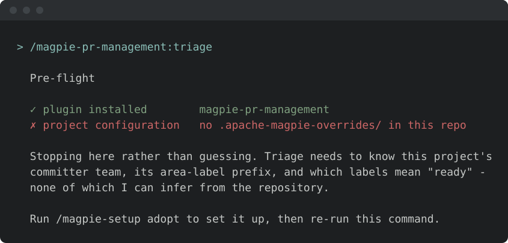
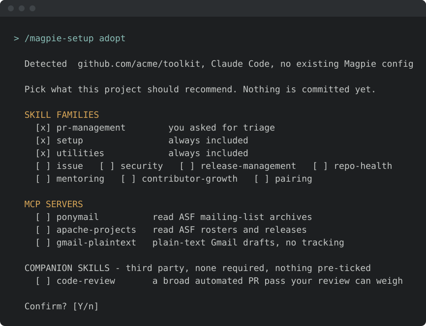
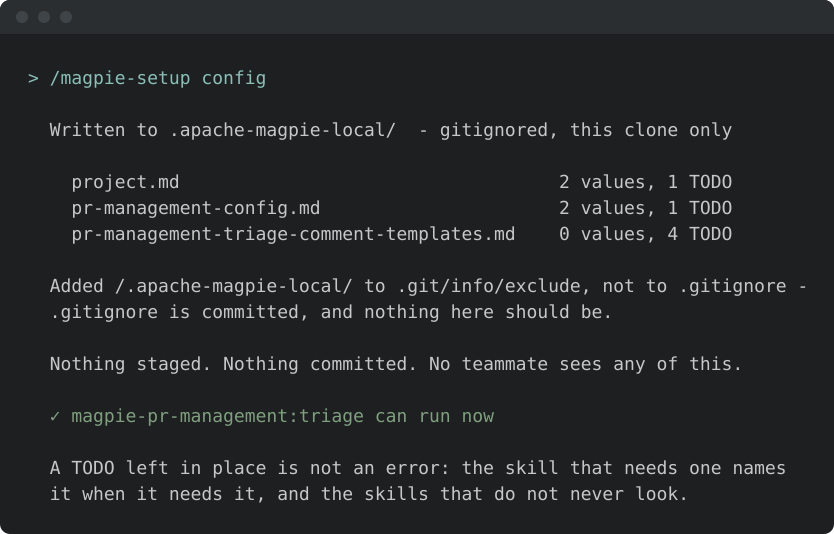
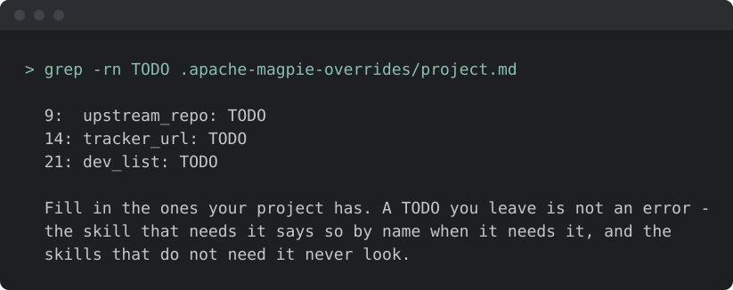
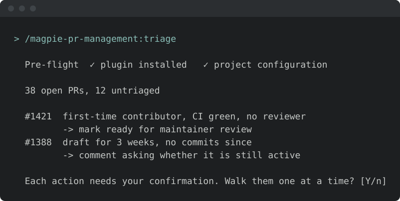

<!-- SPDX-License-Identifier: Apache-2.0
     https://www.apache.org/licenses/LICENSE-2.0 -->

<!-- START doctoc generated TOC please keep comment here to allow auto update -->
<!-- DON'T EDIT THIS SECTION, INSTEAD RE-RUN doctoc TO UPDATE -->
**Table of Contents**  *generated with [DocToc](https://github.com/thlorenz/doctoc)*

- [Your first run with a family](#your-first-run-with-a-family)
  - [1. Run a skill — it stops](#1-run-a-skill--it-stops)
  - [2. `/magpie-setup adopt` — the wizard](#2-magpie-setup-adopt--the-wizard)
  - [3. It scaffolds, and names what is still missing](#3-it-scaffolds-and-names-what-is-still-missing)
  - [4. Fill in the ones it named](#4-fill-in-the-ones-it-named)
  - [5. Run it again](#5-run-it-again)
  - [What else the wizard offered](#what-else-the-wizard-offered)
    - [MCP servers — backends a few skills read through](#mcp-servers--backends-a-few-skills-read-through)
    - [Companion skills — other people's packages](#companion-skills--other-peoples-packages)
  - [What you configured, and what you did not](#what-you-configured-and-what-you-did-not)
  - [Where to go next](#where-to-go-next)

<!-- END doctoc generated TOC please keep comment here to allow auto update -->

<!-- SPDX-License-Identifier: Apache-2.0
     https://www.apache.org/licenses/LICENSE-2.0 -->

# Your first run with a family

Installing a family puts its skills in your agent. It does not tell them
anything about your project — which repository, which tracker, which labels
mean "ready for review". A skill that guessed at those would do the wrong
thing confidently, so instead the first one you run stops and says what it
needs.

This page is that first run, end to end, with `magpie-pr-management` as the
example. Every family works the same way; only the list of files differs, and
each family README carries its own list under *Before the first run*.

The starting point is a family already installed —
[Prerequisite: install Magpie from your agent's
marketplace](../setup/marketplace-install.md) if you have not.

## 1. Run a skill — it stops

Sixty-five of the skills open with this check. It costs three file lookups
and, once the project is set up, prints nothing at all — you will not see it
again.

Notice what it did **not** do: it did not label anything, post anything, or
fall back to a default committer team. Stopping is the feature.

## 2. `/magpie-setup adopt` — the wizard

One question, three groups, nothing committed yet:

- **Skill families** — which families this project recommends. Pre-ticked from
  what you asked for plus what the repository itself suggests; `setup` and
  `utilities` are always in.
- **MCP servers** — the backends some skills read through. For an ASF project
  `ponymail` and `apache-projects` are required and pre-ticked; elsewhere
  nothing is.
- **Companion skills** — third-party packages that pair with the families you
  picked. **Never pre-ticked**, and only ever the ones available on the agent
  you are actually running.

Configuration is the group you have to deal with to get going, so the rest of
this page follows it. The other two are covered in
[what else the wizard offered](#what-else-the-wizard-offered) below — neither
blocks your first run.

> [!NOTE]
> Running plain `/magpie-setup` installs for **you** and writes nothing to the
> repository. `adopt` is the separate act of recommending something for
> everyone who clones it. [Installation or Adoption?](two-ways.md) is the
> difference in one table.

## 3. It scaffolds, and names what is still missing

Three things are staged, and **nothing is committed** — the floor is a
recommendation for every contributor, so it lands through review like any
other committed file:

| Staged | What it is |
|---|---|
| `.apache-magpie.lock` | The floor: the minimum Magpie version and plugin set this project expects. Never a ceiling. |
| `.claude/settings.json` | Derived from the lock. Only two keys are touched; everything else in the file is preserved byte for byte. |
| `.apache-magpie-overrides/` | The configuration templates, one per file the skills read. |

The last line is the one that matters here: it names the files **this** family
needs before it will run, rather than handing you forty templates and wishing
you luck.

## 4. Fill in the ones it named

Every template carries `TODO` markers where a value is missing. You do not
have to fill in all of them, or all of them now:

- A skill that **requires** a file says so by name when it needs it — that is
  step 1 again, with a more specific message.
- A skill that reads a file **optionally** falls back to a documented default
  and never mentions it.

Which is which is on each family's README, under *Before the first run*:
[security](../security/README.md#before-the-first-run) ·
[release-management](../release-management/README.md#before-the-first-run) ·
[pr-management](../pr-management/README.md#before-the-first-run) ·
[issue](../issue-management/README.md#before-the-first-run) ·
[repo-health](../repo-health/README.md#before-the-first-run) ·
[contributor-growth](../contributor-growth/README.md#before-the-first-run) ·
[mentoring](../mentoring/README.md#before-the-first-run) ·
[utilities](../utilities/README.md#before-the-first-run) ·
[pairing](../pairing/README.md#before-the-first-run) ·
[setup](../setup/README.md#before-the-first-run)

Those tables are generated from the skills themselves, so they cannot drift
from what the skills actually read.

## 5. Run it again

The pre-flight passes silently from here on, in this family and every other
one you install into this repository.

## What else the wizard offered

Neither of the other two groups blocks a first run. Both are worth coming back
to once the family is doing something for you.

### MCP servers — backends a few skills read through

Some skills read from somewhere the agent cannot reach on its own: a mailing
list archive, a foundation's roster, a mail account. Those come through MCP
servers, and the wizard offers three:

| Server | What it reads | When you need it |
|---|---|---|
| `ponymail` | ASF mailing-list archives | The primary mail-read backend for the `security` and `release-management` families. **Mandatory for ASF projects**; Gmail is the fallback elsewhere |
| `apache-projects` | ASF rosters, people and releases, read-only | `contributor-nomination` and the security roster paths. **Mandatory for ASF projects** |
| `gmail-plaintext` | — (it *writes*: plain-text Gmail drafts with no tracking redirects) | Only if you draft mail from the agent. Not ASF-gated |

A skill that needs one and cannot find it says so by name, the same way a
skill names a missing configuration file. Nothing silently degrades to a worse
source.

Registering them is a per-machine step, not a per-project one, and the
walkthrough is in
[`/magpie-setup`'s install flow](../setup/marketplace.md#auto-install-arriving-magpie-ready).

### Companion skills — other people's packages

Magpie ships skills for maintaining a project. Some of what a maintainer wants
next is not maintenance — scanning your own code for vulnerabilities, or a
method for thinking a change through before writing it — and other people have
built those well.

The wizard offers them, **never pre-ticked**, and only the ones available on
the agent you are running: a package that exists for Claude Code alone is not
offered to a Codex user with a command they cannot run.

None of them is a dependency. Every family works with none installed, Magpie
bundles none and fetches none automatically, and each entry says whose it is
so the choice stays yours.

→ [**Companion skill packages**](../setup/companion-skills.md) — what each one
adds to which family, and the install command for every agent that has it.

## What you configured, and what you did not

**Per project, once.** The lock, the derived wiring and the overrides store
are the repository's, committed once and shared by everyone who clones it. A
teammate who clones an adopted repository skips steps 2 through 4 entirely.

**Per machine, once.** The marketplace install, any MCP servers you
registered, and any companion packages are yours, on this machine. No
repository records them, and a teammate cloning this repo gets none of
them — which is why an MCP server a family depends on is named in that
family's prerequisites rather than assumed.

**Never.** Nothing above pins a version, removes a plugin, or limits what you
install for yourself. The floor is a minimum in both dimensions — a
contributor running a newer Magpie with seven families installed satisfies it
completely and is told nothing.

## Where to go next

- [**What each family solves**](families.md) — the ten families, with the
  problem each one solves.
- [**Companion skill packages**](../setup/companion-skills.md) — third-party
  packages that pair with a family, and the install command per agent.
- [**Team adoption**](../setup/team-adoption.md) — what adopting commits, how
  the floor is chosen, and what a contributor sees on clone.
- [**Prerequisites for running framework skills**](prerequisites.md) — what
  individual skills need at run time: a tracker, a mail backend, and so on.
