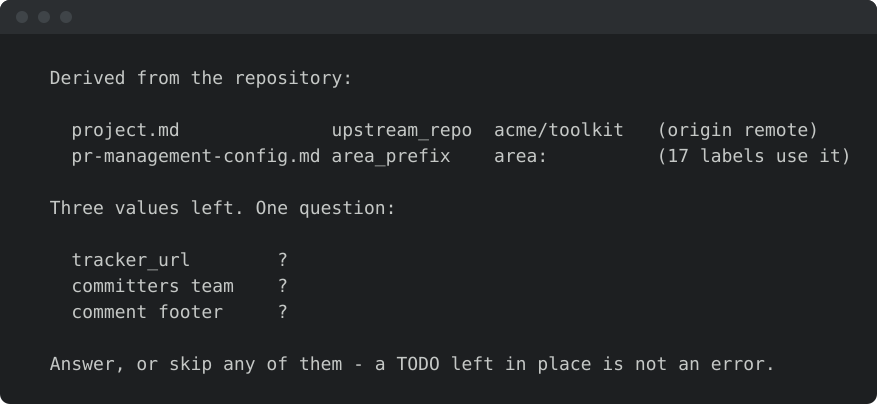
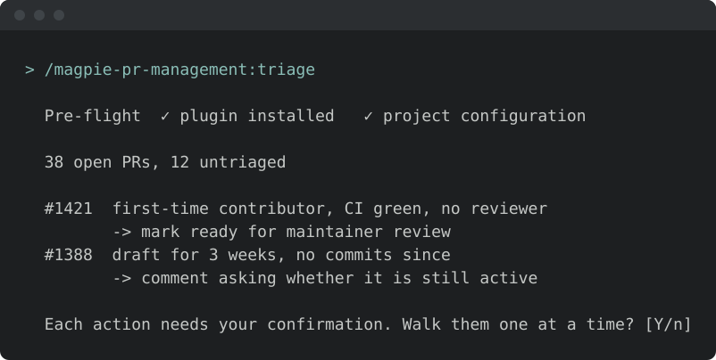
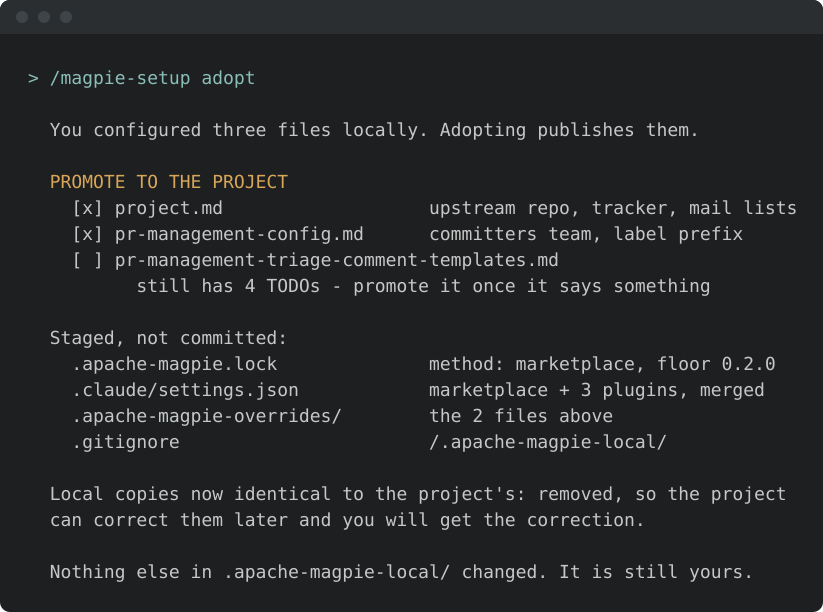

<!-- SPDX-License-Identifier: Apache-2.0
     https://www.apache.org/licenses/LICENSE-2.0 -->

<!-- START doctoc generated TOC please keep comment here to allow auto update -->
<!-- DON'T EDIT THIS SECTION, INSTEAD RE-RUN doctoc TO UPDATE -->
**Table of Contents**  *generated with [DocToc](https://github.com/thlorenz/doctoc)*

- [Your first run with a family](#your-first-run-with-a-family)
  - [1. Run a skill](#1-run-a-skill)
  - [2. Review the configuration](#2-review-the-configuration)
  - [3. Inspect the local files](#3-inspect-the-local-files)
  - [4. Run it again](#4-run-it-again)
  - [5. Only if you are adopting: `/magpie-setup adopt`](#5-only-if-you-are-adopting-magpie-setup-adopt)
  - [Additional integrations](#additional-integrations)
    - [MCP servers — backends a few skills read through](#mcp-servers--backends-a-few-skills-read-through)
    - [Companion skill packages](#companion-skill-packages)
  - [What you configured, and what you did not](#what-you-configured-and-what-you-did-not)
  - [Where to go next](#where-to-go-next)

<!-- END doctoc generated TOC please keep comment here to allow auto update -->

<!-- SPDX-License-Identifier: Apache-2.0
     https://www.apache.org/licenses/LICENSE-2.0 -->

# Your first run with a family

Installing a family makes its skills available to your agent.
Project configuration supplies the repository, tracker, labels, and other values those skills need.
If required files are missing, the skill starts a local configuration flow before doing the requested work.

This example uses an installed `magpie-pr-management` family in a repository with no Magpie configuration.
For installation commands, see the [marketplace reference](../setup/marketplace-install.md).
Complete the [isolation and privacy setup](../quick-start.md#step-3--isolate--guard) before running against external or private data.

Steps 1–4 configure individual use.
Step 5 is optional team adoption.
The terminal illustrations show example output, not results from your repository.

## 1. Run a skill

From the target repository, enter:

```text
/magpie-pr-management:triage
```


The pre-flight check invokes [`/magpie-setup config`](../../skills/setup/config.md) when required configuration files are missing.
That flow writes only local, gitignored configuration; it does not stage or commit files.
Triage does not proceed with guessed repository or tracker values.

Once the required configuration resolves, the pre-flight check completes without prompting.
It runs on subsequent invocations too, so later drift or missing files can still interrupt a task.

## 2. Review the configuration



Setup reads the skill's requirements and derives values from the repository where possible: the `origin` remote, existing labels, and configured CI checks.
It groups unresolved values into one prompt.

Review the derived repository carefully.
For example, if `origin` points to your fork but you intend to triage the upstream project's PRs, supply the upstream repository.
You may leave an unknown value as `TODO`; a skill that needs it must resolve it before using it.

Local configuration is sufficient for individual use.
You do not need to run `adopt`.

## 3. Inspect the local files


Configuration is written to `.apache-magpie-local/`:

| | `.apache-magpie-local/` | `.apache-magpie-overrides/` |
|---|---|---|
| Written by | `config` | `adopt` |
| Tracked by Git | no | yes |
| Who sees it | you, in this clone | everyone who clones the repo |
| Decision | individual configuration | maintainer approval for shared configuration |

**Local configuration takes precedence per file, not per field.**
If both directories contain `project.md`, the skill reads the local file rather than merging the two.
It can still read a different file, such as `naming-conventions.md`, from the shared directory when no local copy exists.

Setup adds the local directory to `.git/info/exclude`, leaving the tracked `.gitignore` unchanged.
To inspect the result, run:

```bash
git status --short
git check-ignore .apache-magpie-local/project.md
```

In an otherwise clean checkout, the first command should show no tracked changes from configuration.
The second should print the local file's path, confirming it is ignored.

## 4. Run it again



Retry the same command:

```text
/magpie-pr-management:triage
```

With configuration resolved, the skill reads the PR queue and presents its assessment and proposed actions.
The illustration's counts are examples; your output reflects the target repository.
Review the proposals before approving any shared-state changes.

Which files each family needs is on its README under *Before the first run*:
[security](../security/README.md#before-the-first-run) ·
[release-management](../release-management/README.md#before-the-first-run) ·
[pr-management](../pr-management/README.md#before-the-first-run) ·
[issue](../issue-management/README.md#before-the-first-run) ·
[repo-health](../repo-health/README.md#before-the-first-run) ·
[contributor-growth](../contributor-growth/README.md#before-the-first-run) ·
[mentoring](../mentoring/README.md#before-the-first-run) ·
[utilities](../utilities/README.md#before-the-first-run) ·
[pairing](../pairing/README.md#before-the-first-run) ·
[setup](../setup/README.md#before-the-first-run)

Those tables are generated from the skills' declared requirements.

## 5. Only if you are adopting: `/magpie-setup adopt`



Skip this step unless the maintainers have decided to share a Magpie setup.
Adoption is never invoked automatically.

`/magpie-setup adopt` offers to copy selected local files into `.apache-magpie-overrides/`.
It excludes personal values and unfinished `TODO` entries from promotion.
It also removes local copies that are byte-identical to the shared files, so later shared updates are not hidden by stale local copies.
Review the proposed files before committing them.

You may also run `adopt` without configuring locally first; it scaffolds the missing files.
See [team adoption](../setup/team-adoption.md) for the shared recommendation and contributor setup.

## Additional integrations

Installation also offers MCP servers and companion skill packages.
MCP requirements depend on the chosen skill; companion packages are optional.

### MCP servers — backends a few skills read through

Some skills use MCP servers to access mail archives, rosters, or mail accounts.
The installation flow offers these three:

| Server | Access | When you need it |
|---|---|---|
| `ponymail` | ASF mailing-list archives | The primary mail-read backend for the `security` and `release-management` families. **Mandatory for ASF projects**; Gmail is the fallback elsewhere |
| `apache-projects` | ASF rosters, people and releases, read-only | `contributor-nomination` and the security roster paths. **Mandatory for ASF projects** |
| `gmail-plaintext` | Creates plain-text Gmail drafts without tracking redirects | Only if you draft mail from the agent. Not ASF-gated |

A skill reports a missing required backend before proceeding.
Register servers per machine; local project configuration does not install them.
See the [installation flow](../setup/marketplace.md#auto-install-arriving-magpie-ready) for registration details.

### Companion skill packages

Companion packages provide additional workflows, such as code scanning or development planning.
They are optional, are not selected by default, and are offered only for agents they support.

Some require a third-party marketplace.
For example, Superpowers uses `obra/superpowers-marketplace`; adding that marketplace makes its catalogue available, not just the selected package.
The installation flow identifies the publisher and supplies commands for you to run.
Magpie does not bundle or fetch companion packages automatically.

See [companion skill packages](../setup/companion-skills.md) for publishers, purposes, and agent-specific install commands.

## What you configured, and what you did not

| Scope | Contents | Shared through Git? |
|---|---|---|
| Machine | Installed plugins, registered MCP servers, and optional companion packages | No; each contributor needs the required backends locally. |
| Clone | `.apache-magpie-local/` configuration and its Git exclusion | No. |
| Project, after adoption | Recommended version and families, derived agent settings, and `.apache-magpie-overrides/` | Yes. |

A contributor cloning an adopted repository can use its shared configuration without repeating local setup for those files.
They still need the appropriate agent, credentials, and backends.
The marketplace adoption recommendation permits newer versions and additional families; it does not uninstall personal plugins.

## Where to go next

- [**What each family solves**](families.md) — the ten families, with the
  problem each one solves.
- [**Companion skill packages**](../setup/companion-skills.md) — third-party
  packages that pair with a family, and the install command per agent.
- [**Team adoption**](../setup/team-adoption.md) — what adopting commits, how
  the floor is chosen, and what a contributor sees on clone.
- [**Prerequisites for running framework skills**](prerequisites.md) — what
  individual skills need at run time: a tracker, a mail backend, and so on.
